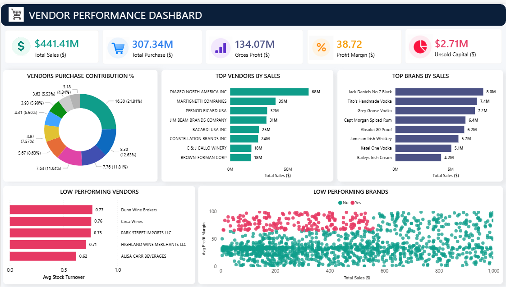

# Vendor Performance Analysis

An end-to-end data analytics project focused on vendor, brand, inventory, and profitability analysis for the retail and wholesale beverage industry.  
The project combines SQL, Python, exploratory data analysis, statistical testing, and dashboarding to uncover actionable business insights.

## Business Problem

Effective inventory and sales management is critical for improving profitability. This project was built to answer questions such as:

- Which vendors and brands contribute the most to sales and gross profit?
- Which brands need promotional or pricing adjustments?
- Does bulk purchasing reduce unit cost?
- How much capital is locked in unsold inventory?
- Do high-performing and low-performing vendors differ significantly in profitability?

## Project Objectives

- Identify top-performing and low-performing vendors and brands.
- Measure the impact of purchase volume on unit cost.
- Analyze inventory turnover and unsold capital.
- Compare profit margin behavior across vendor groups.
- Build a dashboard for fast business decision-making.

## Tools & Technologies

- **Python**
- **Pandas**
- **NumPy**
- **Matplotlib**
- **Seaborn**
- **SQLAlchemy**
- **PostgreSQL**
- **Power BI** / dashboard visualization

## Workflow

### 1. Data Extraction
Connected Python to PostgreSQL and loaded the required tables, including:

- `sales`
- `purchases`
- `purchase_prices`
- `vendor_invoice`

### 2. Exploratory Data Analysis
Explored distributions, summary statistics, correlations, and outliers to understand:

- sales behavior
- purchase behavior
- freight cost variation
- inventory turnover patterns
- profitability differences

### 3. Data Cleaning & Feature Engineering
Created business metrics such as:

- **Gross Profit**
- **Profit Margin**
- **Stock Turnover**
- **Sales / Purchase Ratio**
- **Unsold Inventory Value**

### 4. Vendor and Brand Analysis
Analyzed vendors and brands by:

- total sales
- total purchase value
- gross profit
- purchase contribution percentage
- inventory turnover
- unsold capital

### 5. Statistical Analysis
Applied confidence intervals and a t-test to compare top-performing and low-performing vendors.

## Key Findings

- **DIAGEO NORTH AMERICA INC** is the leading vendor by sales, followed by **MARTIGNETTI COMPANIES** and **PERNOD RICARD USA**.
- The top-selling brands include **Jack Daniels No 7 Black**, **Tito's Handmade Vodka**, and **Grey Goose Vodka**.
- The **top 10 vendors contribute 65.69%** of total purchase contribution, showing strong vendor concentration.
- Bulk buying reduces unit cost significantly:
  - Small orders: **39.07**
  - Medium orders: **15.49**
  - Large orders: **10.78**
- Total unsold capital is approximately **2.71M**, highlighting tied-up inventory value.
- Low-performing vendors show **higher average profit margins** than top-performing vendors.
- The difference in profit margins between top and low-performing vendors is **statistically significant** (`p < 0.001`).

## Business Recommendations

- Reduce over-dependence on a small set of vendors by diversifying procurement.
- Promote or reprice low-sales, high-margin brands to improve volume.
- Use bulk pricing strategies where storage and demand support it.
- Monitor slow-moving inventory to reduce holding costs and unsold capital.
- Focus on vendor-level margin optimization instead of sales volume alone.

## Dashboard Preview



## Repository Structure

```text
.
├── Business_Problem_Statement.pdf
├── Exploratory_Data_Analysis.ipynb
├── Vendor_Performance_Analysis.ipynb
├── Vendor_Performance_Analysis_Dashboard.png
└── README.md
```

## How to Use

1. Clone the repository.
2. Open the notebooks in Jupyter Notebook or JupyterLab.
3. Connect to your PostgreSQL database.
4. Run the EDA notebook first, then the analysis notebook.
5. Review the dashboard image for a summary of key insights.

## Conclusion

This project shows how SQL, Python, and dashboarding can be combined to transform raw sales and inventory data into practical business insights. It helps identify profitable vendors, detect inventory inefficiencies, and support smarter procurement and pricing decisions.
